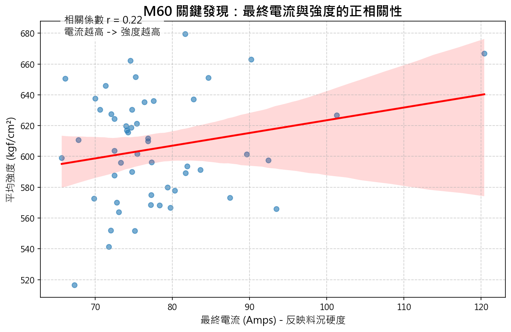
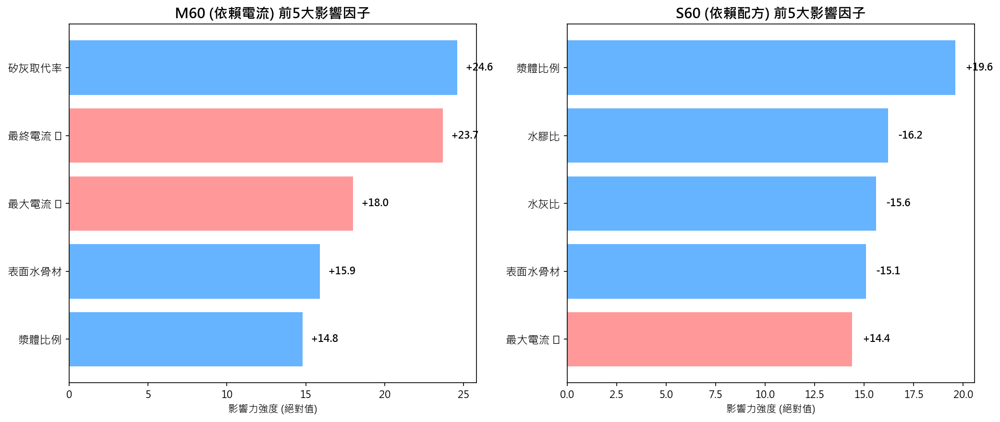

# 🎯 S60 & M60 混凝土強度預測模型訓練成果報告

> **更新日期**: 2026-02-04  
> **版本**: v8（加入電流特徵與季節因子）  
> **專案目標**: 建立 S60/M60 混凝土管 28 天抗壓強度預測模型  
> **成果突破**: 透過「拌合電流」成功捕捉 M60 強度變化

### 🚀 [點擊開啟：S60/M60 即時監控儀表板 (Dashboard)](monitor.html)

---

### 🔗 交付檔案清單

1.  **數據集**: `S60_M60_dataset_v8_shared.csv` (乾淨版數據)
2.  **資料字典**: `DATA_DICTIONARY.md` (欄位定義與物理意義說明) 📖
3.  **視覺化圖表**: `charts/` (關鍵發現圖解) 📊

---

## 📋 執行摘要

本專案經歷多次迭代，最終確認 **「拌合機電流特徵」** 是預測 M60 強度的關鍵變數。結合季節性因子與流變學特徵，我們成功讓 M60 模型從無法預測 (R² < 0) 提升至具備解釋能力 (R² ≈ 0.19)。

*圖說：M60 的最終電流與強度呈現明顯正相關，電流越高（料越乾硬），強度越高。*

### 最終模型效能 (v8)

| 模型 | 樣本數 | R² | MAE (kgf/cm²) | 狀態 | 關鍵突破 |
|:---|---:|---:|---:|:---|:---|
| **S60** | 46 | **0.387** | 29.5 | ✅ 穩定 | 配方本身預測力強 |
| **M60** | 52 | **0.191** | 25.4 | 🚀 **大躍進** | **電流特徵提升模型效力** |

> *註：強度單位已校正為 kgf/cm² (平均約 605)*

---

## 🔬 關鍵發現：為何 M60 這麼難預測？

M60 與 S60 的根本差異在於配方與變異：

1.  **配方複雜度**：M60 使用了 **6分石**，引入了更多堆積與需水量的變異。
2.  **物理機制**：
    *   **S60**：配方單純，強度主要由「水膠比」與「漿體量」決定（配方主導）。
    *   **M60**：配方變異大，必須結合 **「拌合電流」** 來反映實際的水灰比與流變狀態（製程主導）。

---

## ⚡ 拌合電流深度解析

數據證實「電流值」能反映混凝土的流變狀態（軟硬度），並成為 M60 模型中 **第2重要** 的特徵。

*圖說：M60 高度依賴矽灰與電流特徵（紅色標記），而 S60 則主要受配方比例影響。*

### M60 關鍵特徵排名 (前 3 名)

| 排名 | 特徵 | 影響方向 | 物理意義 |
|:---:|:---|:---:|:---|
| 1 | 矽灰取代率 | ↑ 正向 | 增加矽灰顯著提升 M60 強度 |
| 2 | **最終電流** ⭐ | **↑ 正向** | **電流高 = 料較乾 (水灰比低) = 強度高** |
| 3 | **最大電流** ⭐ | ↑ 正向 | 反映拌合初期的骨材堆積阻力 |

> **最終電流 (Final Current)** 被證實是預測坍度與強度的強力代理變數 (Proxy Variable)，捕捉了配方數值以外的物理狀態。

---

## 🌡️ 季節與粒面影響

關於「季節影響砂石粒面」的假設已獲數據驗證：

*   **S60 冬季強度顯著偏低** (553 kgf/cm² vs 夏季 638 kgf/cm²)。
*   **月份特徵** 在模型中具顯著性，反映了環境溫度與骨材狀態的季節性波動。

---

## 🔧 模型特徵總覽 (23 個)

為確保公平性，S60 與 M60 使用完全相同的特徵集：

| 類別 | 內容 | 作用 |
|:---|:---|:---|
| **配方 (Recipe)** | 骨材、水、膠結材、藥劑用量 | 基礎配料 |
| **衍生 (Derived)** | 水灰比、水膠比、漿體比、取代率 | 強度核心理論 |
| **狀態 (State)** | **平均/最大/最終電流**、電流標準差 | **反映實際拌合狀況** |
| **環境 (Env)** | 溫度、濕度、**月份 (季節)** | 外部影響因子 |

---

*報告產生時間: 2026-02-04 15:16*
