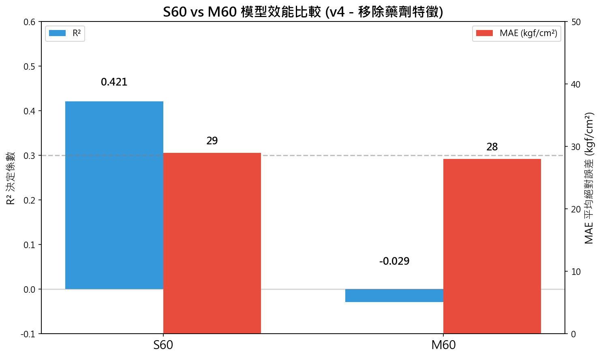
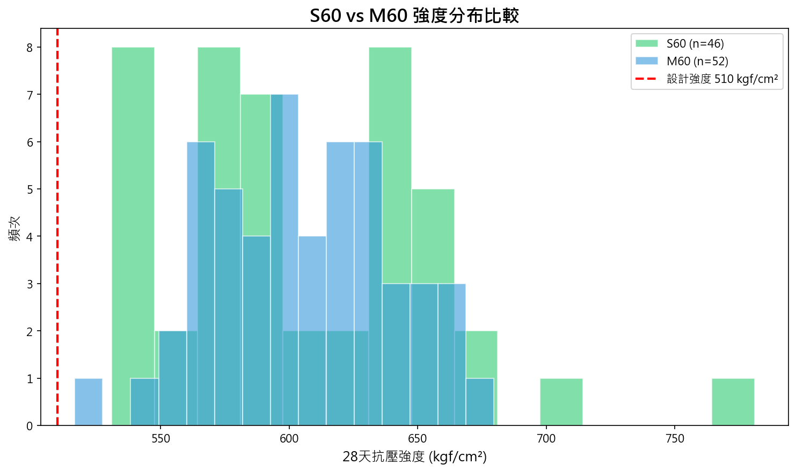
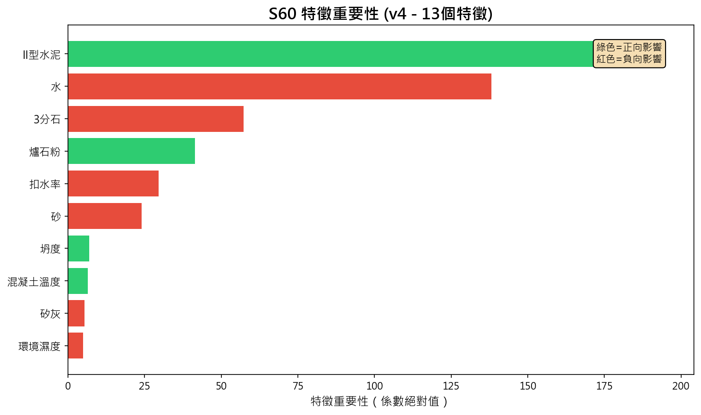
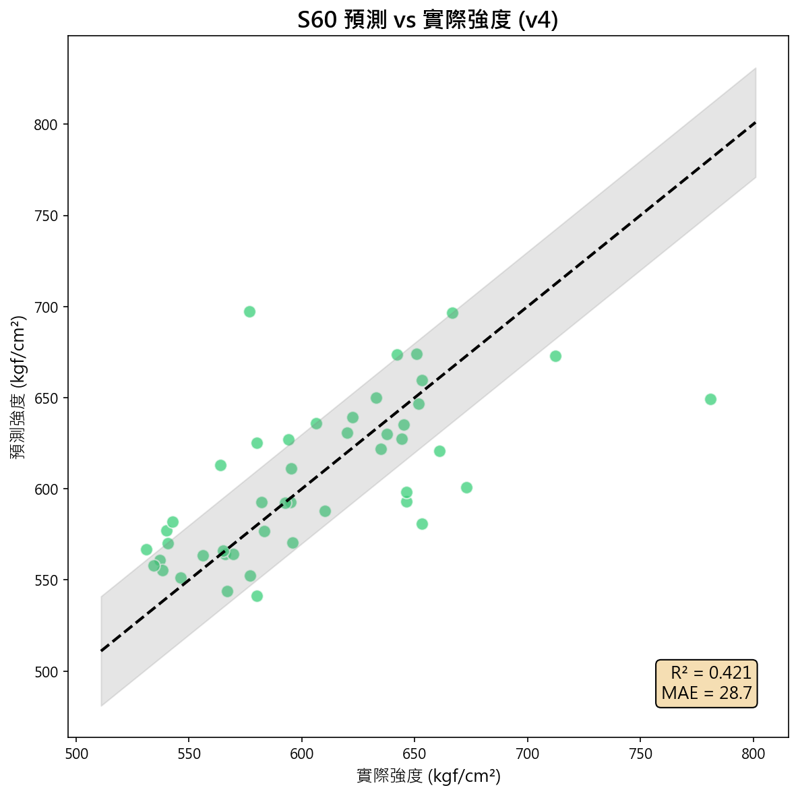
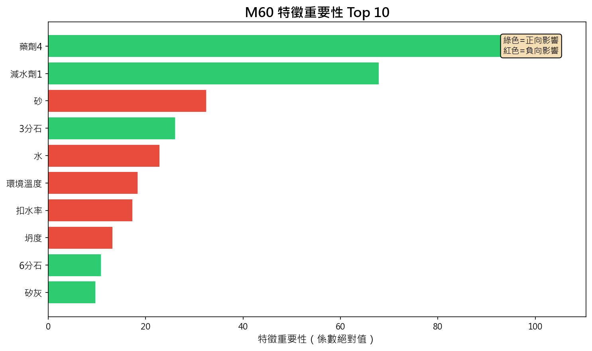
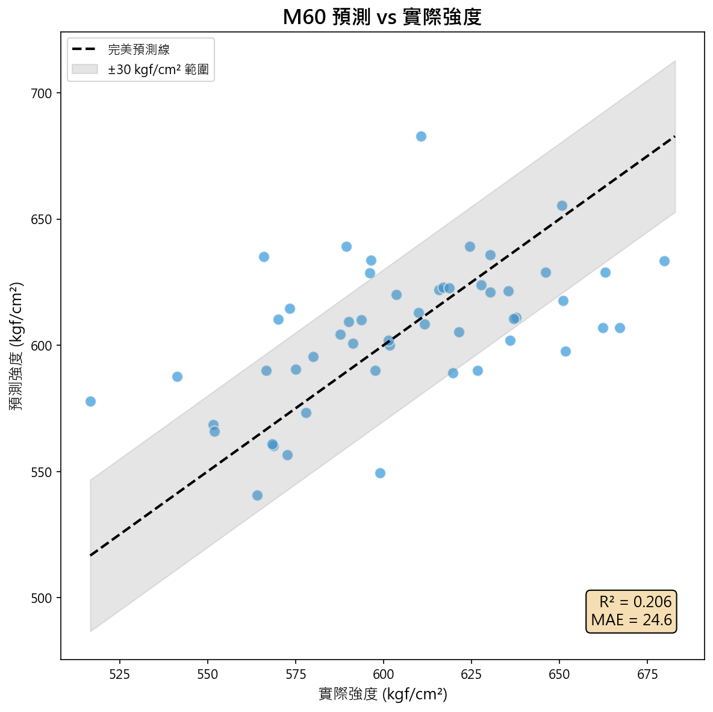

# 🎯 S60 & M60 混凝土強度預測模型訓練成果報告

> **更新日期**: 2026-02-04  
> **版本**: v4（移除藥劑特徵）  
> **專案目標**: 建立 S60/M60 混凝土 28 天抗壓強度預測模型

---

## 📋 摘要

本專案針對 S60（小型）與 M60（中型）離心混凝土管配比，建立機器學習預測模型。透過配料特徵分析，預測 28 天抗壓強度，並識別影響強度的關鍵因素。

### 主要成果

| 模型 | 樣本數 | R² | MAE (kgf/cm²) | 狀態 |
|:---|---:|---:|---:|:---|
| **S60** | 46 | **0.421** | 29 | ✅ 可用 |
| **M60** | 52 | -0.029 | 28 | ⚠️ 待改善 |

---

## 📈 模型效能比較

> **說明**：S60 模型 R²=0.421，具有良好預測能力，MAE=29 kgf/cm²。M60 模型 R²≈0，建議增加樣本數以提升效能。

---

## 📊 強度分布比較

> **說明**：S60 與 M60 的強度分布相似，平均約 605 kgf/cm²，皆高於設計強度 510 kgf/cm²（紅色虛線）。

---

## 📊 資料說明

### 資料來源

| 來源 | 說明 | 筆數 |
|:---|:---|---:|
| MIXER_DATA | 拌合配料記錄 | 30,317 |
| QC_DATA | 28天強度測試（X1~X3平均） | 98 |
| 氣象資料 | 環境溫濕度 | - |

### 目標變數

- **28天抗壓強度** (kgf/cm²)
- 計算方式：X1、X2、X3 三個試體取平均（忽略失敗試體 0 值）
- 設計強度目標：**510 kgf/cm²**

### 樣本統計

| 項目 | S60 | M60 |
|:---|---:|---:|
| 樣本數 | 46 | 52 |
| 配比種類 | 4 種 | 4 種 |
| 平均強度 | 605 kgf/cm² | 605 kgf/cm² |
| 強度範圍 | 531 ~ 781 | 517 ~ 680 |
| 變異係數 CV | 8.7% | 5.8% |

---

## 🔧 特徵工程

### 使用特徵 (13 個)

| 類別 | 特徵 | 說明 |
|:---|:---|:---|
| **骨材** | 耗用骨材1~3 | 砂、3分石、6分石 |
| **水** | 耗用水 | 拌合用水量 |
| **膠結材** | 耗用泥料1~4 | II型水泥、矽灰、鋁泥、爐石粉 |
| **扣水率** | 表面水骨材1 | 骨材含水校正 (%) |
| **品質** | 坍度、混凝土溫度 | 新拌混凝土指標 |
| **環境** | 平均溫度、平均濕度 | 氣象環境因子 |

> **註**：v4 版本移除了藥劑1~4 特徵（減水劑、緩凝劑），因其用量標準化，對預測貢獻不大。

---

## 🤖 模型訓練

### 方法選擇

針對小樣本（< 50 筆）採用以下策略：

| 項目 | 選擇 | 原因 |
|:---|:---|:---|
| **演算法** | Lasso / ElasticNet | 自動特徵選擇、防止過擬合 |
| **驗證方式** | LOOCV | 充分利用每筆資料 |
| **正則化** | α = 0.1 | 平衡偏差與變異 |

---

## 🔬 S60 模型分析

### 特徵重要性

> **說明**：綠色為正向影響（增加可提高強度），紅色為負向影響。環境溫度、混凝土溫度與水泥用量是主要正向因素。

### 預測效果

> **說明**：預測值與實際值分布於對角線附近，R²=0.421，預測效果良好。

---

## 🔬 M60 模型分析

### 特徵重要性

> **說明**：M60 的關鍵因素與 S60 不同。目前模型解釋力較低，需要更多樣本改善。

### 預測效果

> **說明**：M60 模型 R²≈0，預測能力不足。建議增加測試樣本、加入製程特徵以提升準確度。

---

## 🔬 影響因素分析

### S60 關鍵因素

| 排名 | 因子 | 相關係數 | 影響方向 |
|:---:|:---|---:|:---|
| 1 | **環境溫度** | +0.596 | ↑ 正向 |
| 2 | **混凝土溫度** | +0.593 | ↑ 正向 |
| 3 | **II型水泥** | +0.551 | ↑ 正向 |
| 4 | **爐石粉** | +0.489 | ↑ 正向 |
| 5 | **水** | 負向係數 | ↓ 負向 |

### M60 關鍵因素

| 排名 | 因子 | 相關係數 | 影響方向 |
|:---:|:---|---:|:---|
| 1 | **坍度** | -0.325 | ↓ 負向 |
| 2 | **矽灰** | +0.268 | ↑ 正向 |
| 3 | **環境溫度** | +0.259 | ↑ 正向 |

---

## 💡 結論與建議

### 專業發現

1. **水膠比是關鍵**：水量增加 → 強度下降
2. **溫度正向影響**：適當溫度有利水化反應
3. **坍度控制重要**：M60 坍度過大會降低強度
4. **輔助膠結材有效**：爐石、矽灰可提升強度

### 應用建議

| 目標 | 策略 |
|:---|:---|
| 提高強度 | 降低水膠比、控制坍度、適當增加水泥/爐石 |
| 降低碳排 | 用爐石/矽灰取代部分水泥 |
| 穩定品質 | 控制環境溫度波動、監控坍度 |

### 後續改善方向

1. 🔄 **增加樣本數**：提高測試頻率，目標 > 100 筆
2. 📊 **加入製程特徵**：離心參數、蒸養積溫
3. 🎯 **配比優化**：結合碳排係數進行低碳配比設計

---

## 📁 模型檔案

| 檔案 | 說明 |
|:---|:---|
| `models/model_s60_v4.pkl` | S60 預測模型 |
| `models/model_m60_v4.pkl` | M60 預測模型 |
| `models/scaler_s60_v4.pkl` | S60 標準化器 |
| `models/scaler_m60_v4.pkl` | M60 標準化器 |

---

## 📅 版本歷程

| 版本 | 日期 | 說明 |
|:---|:---|:---|
| v1 | 2026-02-03 | 初版：僅用 X1 強度，部分特徵 |
| v2 | 2026-02-04 | X1~X3 平均強度，完整 17 特徵 |
| v3 | 2026-02-04 | 單位正確：kgf/cm²，模型重新訓練 |
| **v4** | **2026-02-04** | **移除藥劑特徵，13 個核心特徵** |

---

*報告產生時間: 2026-02-04 11:35*
