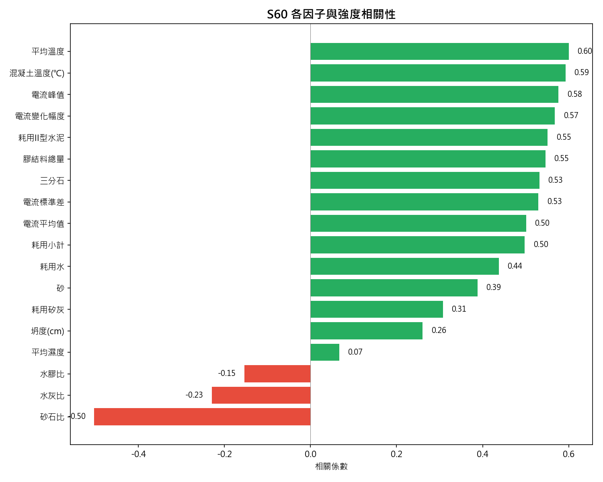
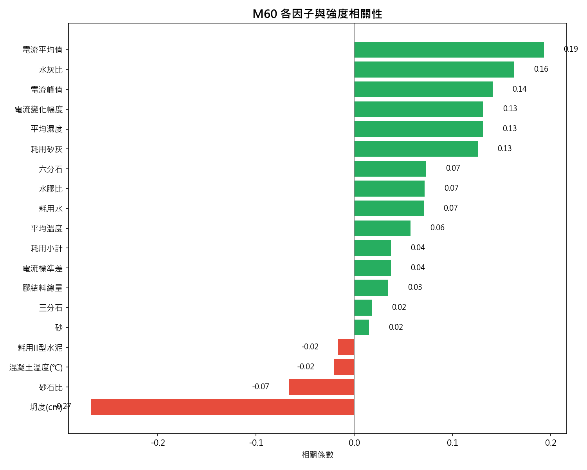
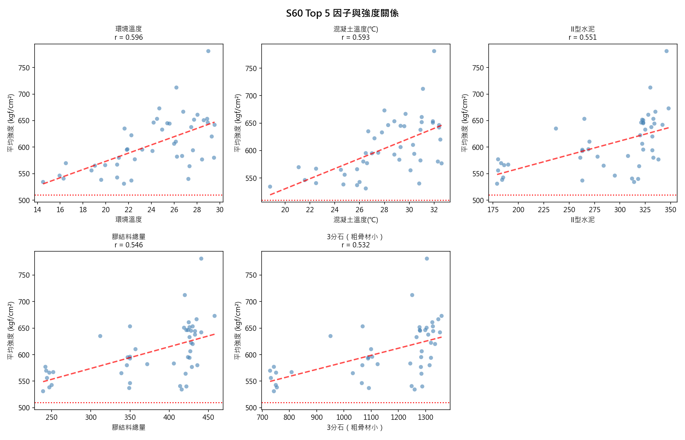
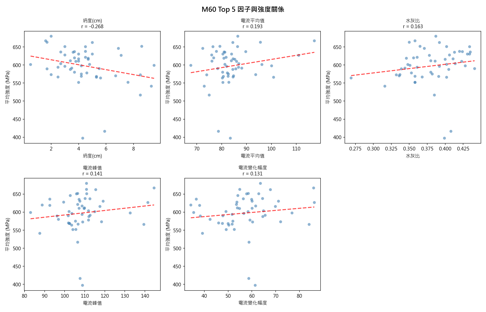
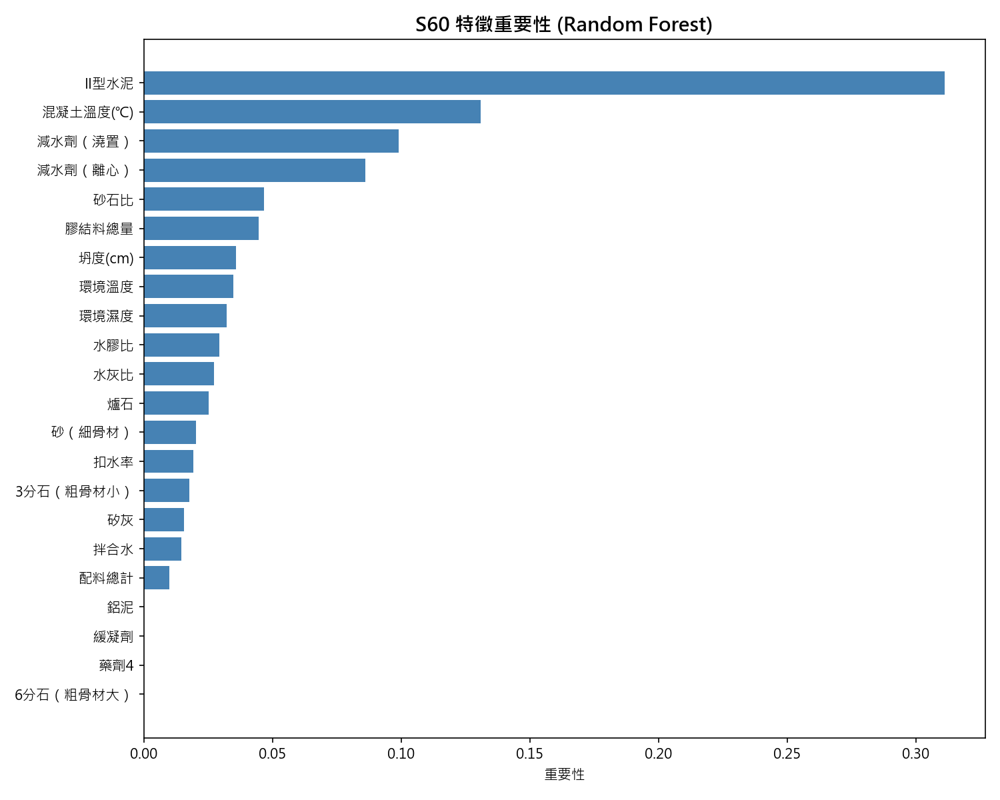
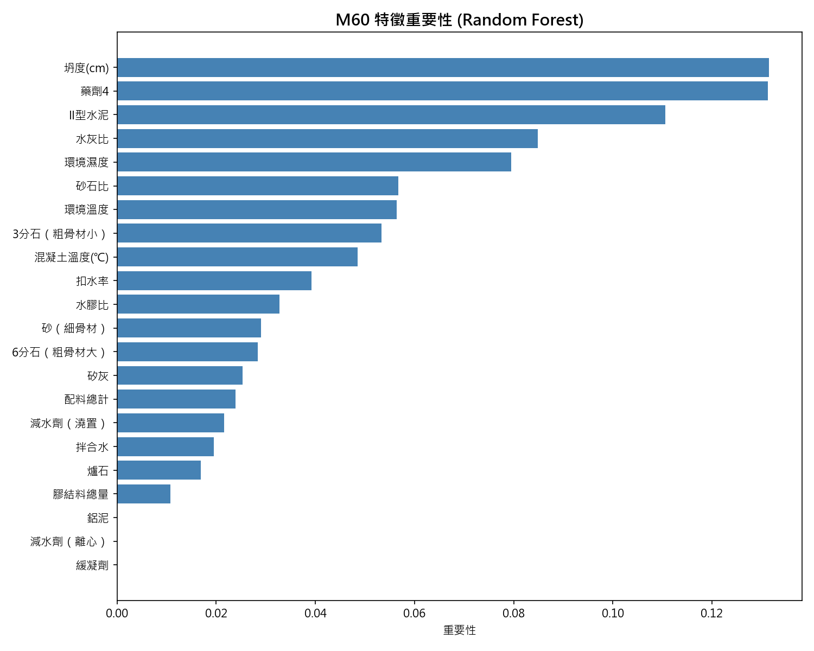

# S60 & M60 混凝土強度分析

混凝土管配比 S60 與 M60 的強度影響因子分析。

## 📊 資料概覽

| 項目 | S60 | M60 |
|:---|---:|---:|
| 樣本數 | 46 | 52 |
| 平均強度 (MPa) | 594.3 | 601.8 |
| 標準差 (MPa) | 48.3 | 52.2 |

## 🔑 關鍵發現

### S60 特徵重要性
1. **耗用II型水泥**: 33.2%
2. 混凝土溫度: 15.8%
3. 平均溫度: 6.9%
4. 砂石比: 5.8%
5. 耗用矽灰: 4.5%

### M60 特徵重要性
1. **坍度**: 11.7%
2. 三分石: 8.9%
3. 平均濕度: 8.7%
4. **水灰比**: 8.1%
5. 耗用II型水泥: 7.6%

## 📈 分析圖表

### 相關係數長條圖

  
   

### Top 5 因子散佈圖

  
   

### 特徵重要性 (Random Forest)

  
   

## 📁 檔案說明

| 檔案 | 說明 |
|:---|:---|
| `S60_M60_with_slump.csv` | 完整分析資料 (142筆，有坍度記錄) |
| `*_correlation_bar.png` | 相關係數排序圖 |
| `*_top5_scatter.png` | Top 5 因子散佈圖 |
| `*_feature_importance.png` | 機器學習特徵重要性 |
| `*_correlation_heatmap.png` | 相關係數熱力圖 |

## 📋 欄位說明

### 原料消耗
| 欄位 | 說明 |
|:---|:---|
| 砂 | 細骨材消耗量 |
| 三分石 | 3分石消耗量 |
| 六分石 | 6分石消耗量 |
| 耗用II型水泥 | II型水泥消耗量 |
| 耗用矽灰 | 矽灰消耗量 |
| 耗用爐石 | 爐石粉消耗量 |

### 衍生特徵
| 欄位 | 公式 |
|:---|:---|
| 水灰比 | 耗用水 / 水泥 |
| 水膠比 | 耗用水 / (水泥+矽灰+爐石) |
| 膠結料總量 | 水泥 + 矽灰 + 爐石 |
| 砂石比 | 砂 / (砂 + 石) |

### 電流特徵
| 欄位 | 說明 |
|:---|:---|
| 電流峰值 | 拌合過程最大電流 |
| 電流平均值 | 拌合過程平均電流 |
| 電流變化幅度 | 峰值 - 最小值 |
| 拌合時間_秒 | 總拌合秒數 |

## 🛠️ 分析工具

- Python 3.x
- pandas, numpy
- matplotlib, seaborn
- scikit-learn (RandomForestRegressor)

## 📅 更新日期

2026-02-03
